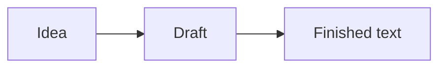

# A Place for Thoughts

One document. **Live formatting.** No separate preview window.
Click into the text to edit the source directly. **Ctrl+B** makes text bold, *Ctrl+I* adds italics, `Ctrl+E` formats inline code, and [Ctrl+K](https://help.obsidian.md) creates a link.

## Working Table

Write directly inside the cells. Tab moves forward; Shift+Tab moves back. Hover near a row edge or above a column boundary to reveal a **+** control. Drag a divider in the header to resize columns. Right-click for more table actions.

| Stage | What happens here | Status |
| :--- | :--- | :---: |
| **Idea** | Collect thoughts and links | [x] Done |
| Draft | Write, select, undo | [ ] In progress |
| Review | Change the window width and font size | [ ] Next |

## Text with Some Character

**Bold**, *italic*, ***both at once***, ~~strikethrough~~, and ==highlighted text==. Formatting can be nested: **bold text with *italics* inside it**. Escaping: \*plain asterisks\*. Symbols: &mdash; &hellip; &copy;.

> [!tip] It is still plain Markdown
> Selection and copy return the source text. Formatting, checkboxes, and table edits can be undone with Ctrl+Z.

### A Small Plan

- [x] Build the standalone editor
- [ ] Check keyboard shortcuts
- [ ] Finish the note
  - Add a nested item
  - Leave another thought here

1. Start with the first step
2. Press Enter to continue the list
3. Press Enter on an empty item to leave the list

> A useful editor helps you focus on the content.
> And stays out of the way while you are reading it.

### Code and Formulas

```lua
local note = { title = "Notes", ready = true }
for key, value in pairs(note) do
  print(key, value)
end
```

A simple formula: $E = mc^2$, and Greek letters: $\alpha + \beta = \gamma$. More complex LaTeX remains editable as source text.



## Links and Details

[Jump back to the table](#working-table) · [[Another Note|internal link]] · #notes #work/text

Text can have a footnote[^note], <kbd>keyboard keys</kbd>, <mark>highlighted text</mark>, and <u>underlined text</u>.

[^note]: A footnote remains an editable part of the document.

---

%% This comment is visible while its line is being edited. %%

#### A Little More Hierarchy

##### Fifth Level

###### Sixth Level

Ready. From here, it is your text.
