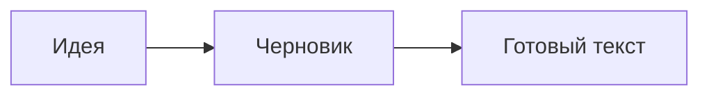

# Место для мыслей

Один документ. **Живое оформление.** Никакого отдельного окна предпросмотра.
Кликните в текст, чтобы редактировать исходную разметку. **Ctrl+B** — жирный, *Ctrl+I* — курсив, `Ctrl+E` — код, [Ctrl+K](https://help.obsidian.md) — ссылка.

## Рабочая таблица

Пишите прямо в ячейках. Tab переходит дальше, Shift+Tab — назад. Наведите мышь на границу строки или над границей колонок: появится **+**. Колонки можно растянуть за разделитель в заголовке; остальные действия — в меню правой кнопки.

| Этап | Что делаем | Состояние |
| :--- | :--- | :---: |
| **Идея** | Собираем мысли и ссылки | [x] Готово |
| Черновик | Пишем, выделяем, отменяем | [ ] В работе |
| Проверка | Меняем ширину окна и размер шрифта | [ ] Дальше |

## Текст с характером

**Жирный**, *курсив*, ***оба сразу***, ~~зачёркнутый~~ и ==важный фрагмент==. Можно вложить **курсив *внутрь* жирного текста**. Экранирование: \*обычные звёздочки\*. Символы: &mdash; &hellip; &copy;.

> [!tip] Всё остаётся обычным Markdown
> Выделение и копирование возвращают исходный текст. Форматирование, флажки и операции таблицы отменяются через Ctrl+Z.

### Небольшой план

- [x] Собрать независимый редактор
- [ ] Проверить сочетания клавиш
- [ ] Дописать заметку
  - Вложенный пункт
  - Ещё одна мысль

1. Первый шаг
2. Следующий шаг — Enter продолжает список
3. Enter на пустом пункте завершает список

> Хороший инструмент помогает сосредоточиться на содержании.
> И не мешает читать собственный текст.

### Код и формулы

```lua
local note = { title = "Заметки", ready = true }
for key, value in pairs(note) do
  print(key, value)
end
```

Простая формула: $E = mc^2$, греческие буквы $\alpha + \beta = \gamma$. Сложная LaTeX-разметка сохраняется как исходный текст.



## Связи и детали

[Перейти к таблице](#Рабочая%20таблица) · [[Заметка|внутренняя ссылка]] · #заметки #работа/текст

Текст со сноской[^note]. Поддерживаются <kbd>клавиши</kbd>, <mark>выделение</mark> и <u>подчёркивание</u>.

[^note]: Сноска остаётся редактируемой частью документа.

---

%% Этот комментарий виден, когда курсор находится в его строке. %%

#### Ещё немного иерархии

##### Пятый уровень

###### Шестой уровень

Готово. Дальше — ваш текст.
